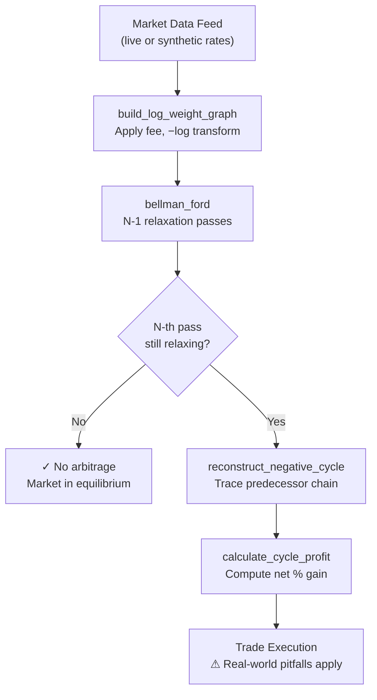

# Triangular Arbitrage Detection Engine
### Mathematical Explainer & Critical Analysis

---
## The Problem: Triangular Arbitrage in Decentralized Markets

**The Financial Context**
Global foreign exchange (Forex) and cryptocurrency markets are massive, decentralized networks. Because exchange rates are driven by localized supply and demand across different order books, the direct price between two assets can temporarily fall out of sync with the implied "cross-rate" routed through other assets.

**The Intuition**
If you start with 1.00 USD, convert it to EUR, convert that EUR to GBP, and finally convert the GBP back to USD, you should theoretically end up with exactly 1.00 USD (minus transaction fees). However, during periods of high volatility or fragmented liquidity, price discrepancies create a closed loop where the final output is strictly greater than the initial input (e.g., returning 1.004 USD). This is a risk-free exploit known as Triangular Arbitrage.

**The Computational Challenge**
While manually calculating the profit for a single 3-leg cycle is trivial, real-world markets contain hundreds of tradable assets, creating millions of potential cyclical paths of varying lengths. Brute-forcing every possible permutation is computationally impossible in a quantitative trading environment where pricing inefficiencies vanish in milliseconds. 

The core engineering problem this project solves is translating a raw financial matrix of exchange rates into a continuous graph data structure, allowing a polynomial-time shortest-path algorithm to systematically isolate profitable loops without brute-force guessing.

## Part I — The Mathematical Foundation: Why Negative Logarithm?

### 1.1 The Multiplicative Arbitrage Condition

Consider a cycle of $k$ currencies. For each trade leg $i$, let $r_i$ be the **net exchange rate** (after fees). Arbitrage profit exists when:

$$\prod_{i=1}^{k} r_i > 1$$

This is a **multiplicative** condition. Standard shortest-path algorithms (Dijkstra, Bellman-Ford) operate on **sums**, not products. We need to convert.

### 1.2 The Logarithm Bridge

Apply $\log$ to both sides (log is monotonically increasing, so the inequality direction is preserved):

$$\log\!\left(\prod_{i=1}^{k} r_i\right) > \log(1) = 0$$

By the **log-product identity** ($\log(ab) = \log a + \log b$):

$$\sum_{i=1}^{k} \log(r_i) > 0$$

### 1.3 Negation → Negative Cycle

Bellman-Ford detects **negative** weight cycles — cycles where the sum of weights is $< 0$. Multiply through by $-1$ (flip inequality):

$$\sum_{i=1}^{k} \underbrace{-\log(r_i)}_{w_i} < 0$$

**This is exactly a negative weight cycle.** We define each edge weight as:

$$\boxed{w(u \to v) = -\log\!\bigl(r(u \to v) \times (1 - f)\bigr)}$$

where $f$ is the per-leg transaction fee fraction.

### 1.4 Summary Table

| Condition | Financial Meaning | Mathematical Form |
|---|---|---|
| $\prod r_i > 1$ | Arbitrage exists | Multiplicative |
| $\sum \log r_i > 0$ | Same, after log | Additive |
| $\sum -\log r_i < 0$ | Same, negated | **Negative cycle** |
| $w_i = -\log(r_i \cdot (1-f))$ | Fee-adjusted edge | Bellman-Ford input |

---

## Part II — Bellman-Ford Algorithm Walkthrough

### 2.1 Algorithm Phases

```
Initialise:  dist[source] = 0,  dist[v] = +∞  ∀ v ≠ source
             predecessor[v] = None  ∀ v

Phase 1 — Relax (N−1) times:
  For each iteration 1..N−1:
    For each edge (u, v, w):
      If dist[u] + w < dist[v]:
        dist[v]       ← dist[u] + w
        pred[v]       ← u

Phase 2 — Detect (N-th relaxation):
  For each edge (u, v, w):
    If dist[u] + w < dist[v]:
      ← NEGATIVE CYCLE CONFIRMED, v is on or near it
```

### 2.2 Why N−1 Relaxations Suffice (Without Negative Cycles)

After exactly $k$ relaxations, `dist[v]` holds the shortest path to $v$ **using at most $k$ edges**. A simple path in a graph with $N$ vertices uses at most $N-1$ edges. So after $N-1$ relaxations, all shortest paths have been found *if no negative cycles exist*.

If a negative cycle exists, some path can be shortened indefinitely by traversing the cycle again — hence the N-th pass still finds improvements.

### 2.3 Cycle Isolation (Backtrace)

Walking the predecessor chain starting from a vertex detected in Phase 2 does **not** immediately give you the cycle — you may be on a path *leading to* the cycle. The solution:

1. Walk the predecessor chain **N times** — you're guaranteed to be inside the cycle.
2. Then collect vertices until you revisit the entry point.
3. Reverse for forward-direction output.

---

## Part III — Critical Analysis

### ❓ Question 1: What happens if we skip the log transform?

Running Bellman-Ford directly on raw exchange rates is **fundamentally broken**:

**Reason 1 — Wrong algebraic operation.**
Bellman-Ford accumulates edge weights via *addition*: `dist[v] = dist[u] + w`. Profit from a sequence of FX trades is computed by *multiplication*. Adding exchange rates together has no financial meaning — `1.09 + 0.84 = 1.93` is not a profit figure.

**Reason 2 — Negative cycles cannot exist.**
All raw exchange rates are positive real numbers. Any sum of positive numbers is positive. Therefore, no cycle of raw-rate edges can ever have a negative total weight. Bellman-Ford's Phase 2 will **never trigger** — the algorithm always reports "no arbitrage" regardless of the actual market structure.

**Reason 3 — Shortest path finds the wrong thing.**
The "shortest path" in the raw-rate graph minimises the *sum of rates*, which would bias toward paths through currencies with small exchange rates (e.g., USD→JPY has a rate of ~149, which would be treated as a *costly* edge and avoided — the exact opposite of FX intuition).

> The engine's Demo 4 confirms this: even with a +0.34% gross arbitrage injected into the graph, Bellman-Ford on raw rates reports zero cycles.

---

### ❓ Question 2: How does the 0.1% fee alter weights, and what happens at fee = 0?

**Mathematical effect on each edge weight:**

With fee $f$:
$$w(u \to v) = -\log(r_{uv} \cdot (1 - f)) = -\log(r_{uv}) - \log(1-f)$$

Since $f > 0$, we have $\log(1-f) < 0$, so $-\log(1-f) > 0$.

Each edge weight **increases by** $-\log(1-f)$ compared to the zero-fee case. For $f = 0.001$:

$$\Delta w = -\log(0.999) \approx +0.001001 \text{ per edge}$$

For a 3-leg cycle, the total weight penalty from fees is approximately:
$$3 \times 0.001001 \approx 0.003003$$

In financial terms, the cycle's gross profit must exceed **~0.3%** just to break even after fees. Only cycles with a gross multiplier $> 1.003$ survive as net-positive negative cycles.

**Effect of removing the fee ($f = 0$):**

Each edge weight decreases by $\approx 0.001$. Cycles that were previously slightly above zero (unprofitable) now fall below zero (detectable). The engine detects **more cycles** — including many that are only marginally profitable in a frictionless world and would be money-losing in practice. Demo 3 confirms this: the zero-fee run detects the same cycle but with full gross profit (+0.34% vs +0.14% net).

> **Key insight:** Transaction fees act as a *detection threshold*. They filter out phantom arbitrage cycles caused by rounding, data latency, or bid/ask spread noise. Setting $f = 0$ makes the engine hypersensitive and operationally useless.

---

### ❓ Question 3: Fundamental software engineering pitfalls in live HFT

This Python engine is a **research-grade detector**, not a production trading system. Deploying it live against institutional bots exposes at least these critical failures:

#### 🔴 Pitfall 1 — Execution Latency (Microseconds vs. Seconds)

Triangular arbitrage windows in liquid FX markets (e.g., Binance, CME) last **microseconds to milliseconds**. Python's GIL, interpreter overhead, and garbage collector introduce **milliseconds to tens of milliseconds** of latency. By the time this engine finishes its Bellman-Ford scan and routes a trade, the opportunity has been closed by a C++/FPGA co-located bot.

**Real-world benchmark:** JANE Street, Citadel, and Virtu Financial operate at sub-100μs order-to-fill latency with kernel-bypass networking (DPDK), custom network stacks, and FPGA-based order routing. A Python script cannot compete.

#### 🔴 Pitfall 2 — Stale Rate Data (The Observation-Execution Gap)

The engine operates on a **snapshot** of exchange rates. In a live order book:
- Rates change tick-by-tick.
- The rate you *observed* and the rate you *execute at* are almost never the same (slippage).
- During the time your engine computes, the rates used to detect the cycle may already be invalid.

This is called the **observation-execution gap**. An arb cycle that looked profitable on T=0 data may be a losing trade by T=10ms (execution time). Every detected cycle must be treated as a *candidate*, not a *guaranteed profit*.

#### 🔴 Pitfall 3 — Partial Fill & Liquidity Risk

The profit calculation assumes **full execution at the quoted rate** for the full notional amount. In practice:
- Large orders move the market (market impact).
- The order book has limited depth at the best bid/ask.
- A 3-leg arbitrage can experience partial fills on any leg, leaving you with an **open currency position** — net exposure to directional FX risk.

A robust system must model:
- Available liquidity at each price level.
- Maximum position size given book depth.
- Leg-by-leg risk management if any fill fails.

#### 🟡 Pitfall 4 — No Rate-of-Change Guard

The Bellman-Ford scan here runs once per snapshot. A production system needs:
- A **minimum profit threshold** above pure transaction costs (to absorb slippage, network jitter, and execution uncertainty).
- A **rate staleness check** — refuse to trade on data older than X milliseconds.
- A **circuit breaker** — halt trading if the system detects anomalous rates (flash crashes, fat-finger errors) that produce false arb signals.

---

## Part IV — Architecture Summary



---

## Part V — File Reference

| File | Purpose |
|---|---|
| [`triangular_arbitrage_engine.py`] | Complete engine — all 7 sections |

**Key functions:**

| Function | Location | Role |
|---|---|---|
| [`build_synthetic_market`] | Section 1 | Generates noisy FX rate matrix |
| [`build_log_weight_graph`] | Section 2 | Applies fee + log transform |
| [`bellman_ford`] | Section 3 | Core BF with negative cycle detection |
| [`reconstruct_negative_cycle`] | Section 4 | Backtrace cycle from predecessor array |
| [`calculate_cycle_profit`] | Section 4 | Gross and net P&L of the cycle |
| [`run_engine`] | Section 5 | Full pipeline orchestration |
| [`bellman_ford_raw_rates`] | Section 6 | Broken diagnostic (educational) |
